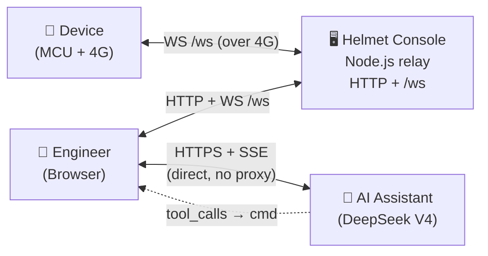
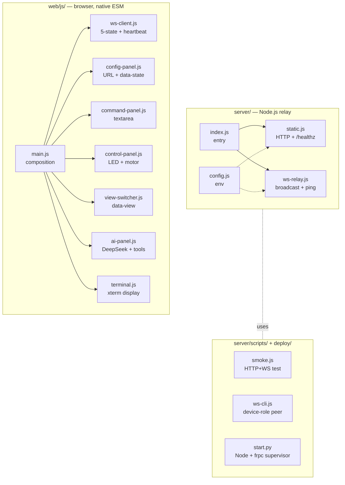

<div align="center">

# Helmet Console

**Lightweight host-side WebSocket relay & web console for embedded devices**


</div>

A single Node.js process serves the browser UI and relays WebSocket
frames between browsers and devices. The wire is **flat UTF-8 text** —
one command per frame, terminated by `\n`. No JSON envelope. The MCU
side dispatches with `strncmp`; the browser shows raw bytes in xterm.

> Why another console? Most serial / WS consoles either bundle a SaaS,
> require a build pipeline, or wrap every frame in JSON for "structure".
> This one stays out of the way: zero parsing on the server, zero build
> tools on the front-end, and every frame you type is what the device
> sees.

---

## Features

- **Forward-only relay** — server never reads command content (one
  exception: `ping` → `pong\n`). No persistence, no allow-lists, no
  schema. New verbs need no server change.
- **Native browser ESM** — `web/` loads directly from `<script type="module">`.
  No Vite, no Webpack, no framework runtime.
- **Three views in one viewport** — terminal (xterm + command bar),
  device control panel (LED + motor switch/gear), and an AI assistant
  view that talks to DeepSeek V4 directly from the browser and
  translates `tool_calls` into the same flat-text commands.
- **Resilient WS client** — 5-state machine, exponential backoff
  reconnect (1s · 2s · 4s · 8s · 16s), 30s heartbeat, 45s stale detect.
- **MCU-friendly protocol** — `led_on\n`, `motor_speed_3\n`. Dispatch
  with `strcmp`; no cJSON, no length prefix, no masking layer.
- **Local-first deployment** — works on `localhost`; optional one-line
  frp tunnel script for public ingress (BYO domain/VPS/token).

---

## Architecture



The browser is the only place that knows about commands. AI runs in the
browser too — the API key stays in `localStorage`, never on the server.
Server bytes are pure passthrough.

For the full module diagram, command dictionary, state machine, and
deferred extensions, see [`docs/architecture.md`](docs/architecture.md).

---

## Quick Start

```bash
git clone <this-repo>
cd helmet-console
npm install
npm start
# → http://127.0.0.1:8080
```

Open the URL, click **连接** (the URL field defaults to
`ws://127.0.0.1:8080/ws`), and type a command. With no device
connected, run a second client locally to play the device role:

```bash
echo "temp=42.3" | node server/scripts/ws-cli.js
```

Then send `led_on` from the browser and watch it arrive on the cli.

---

## Sending Commands

Any UTF-8 text line ending in `\n` is a frame. The browser's command
bar splits multi-line input on `\n` so the device never has to handle
frame boundaries.

| Frame                             | Direction        | Meaning                 |
| --------------------------------- | ---------------- | ----------------------- |
| `led_on\n` · `led_off\n`          | browser → device | Toggle LED              |
| `led_color_<white\|red\|green>\n` | browser → device | Set LED color           |
| `motor_speed_<0..3>\n`            | browser → device | Set motor gear          |
| `state:led=…,motor=…\n`           | browser → peers  | Best-effort UI snapshot |
| any UTF-8 text (`temp=42.3\n`, …) | device → browser | Free-form telemetry     |
| `ping\n` / `pong\n`               | client ↔ server  | Heartbeat               |

Add new verbs at will — the server doesn't maintain a registry. Browser
and device negotiate vocabulary directly. See
[`docs/interface.md`](docs/interface.md) for the full contract.

---

## Repository Layout

```
helmet-console/
├── server/        Node.js relay (composition + sirv + ws)
├── web/           Native browser ESM UI (no build)
├── deploy/        One-shot launcher + frp tunnel template
├── docs/          Architecture, interface, deployment, contributing
└── .trellis/      Per-package coding specs + AI workflow files
```



> Modules never import each other directly — `main.js` wires everything
> via injected callbacks. Single writers: `config-panel.js` owns
> `console.ws.*` + `.app-shell[data-state]`; `view-switcher.js` owns
> `.app-shell[data-view]`; `ai-panel.js` owns `console.ai.*`.

---

## Quality Checks

```bash
npm test              # ESLint + smoke (HTTP / WS broadcast / ping / binary close)
npm run format:check  # Prettier
npm run lint          # ESLint only
```

The smoke script (`server/scripts/smoke.js`) runs an ephemeral server
and asserts:

- `/healthz` returns `{ status: "ok", clients: 0 }`.
- Two WS clients can broadcast to each other byte-for-byte.
- `ping\n` is answered with `pong\n` (and not broadcast).
- Binary frames close the offending socket with code `1003`.

A `commit-msg` git hook (via `simple-git-hooks` + `commitlint`) enforces
[Conventional Commits](https://www.conventionalcommits.org/).

---

## Deployment

**Local only** — `npm start`. That's it.

**Public ingress (frp tunnel)** — `python deploy/start.py` boots Node +
`frpc` together. You bring your own VPS, frps token, and domain; the
script supervises both processes and prints connection URLs.
See [`deploy/deploy.md`](deploy/deploy.md) for prerequisites and
[`docs/deployment.md`](docs/deployment.md) for env vars and reverse-proxy
config.

---

## Documentation

| Doc                                            | Audience                                       |
| ---------------------------------------------- | ---------------------------------------------- |
| [`docs/architecture.md`](docs/architecture.md) | System shape, modules, protocol, state machine |
| [`docs/interface.md`](docs/interface.md)       | HTTP routes + WebSocket contract               |
| [`docs/deployment.md`](docs/deployment.md)     | Env vars, reverse proxy, smoke checks          |
| [`docs/contributing.md`](docs/contributing.md) | Branch flow, commits, formatting               |
| [`deploy/deploy.md`](deploy/deploy.md)         | Local-first frp tunnel setup (BYO)             |
| [`CHANGELOG.md`](CHANGELOG.md)                 | Release notes                                  |

For coding rules used by AI collaborators, see
[`.trellis/spec/`](.trellis/spec/) (backend / frontend / shared guides).

---

## License

MIT. See [`LICENSE`](LICENSE).
