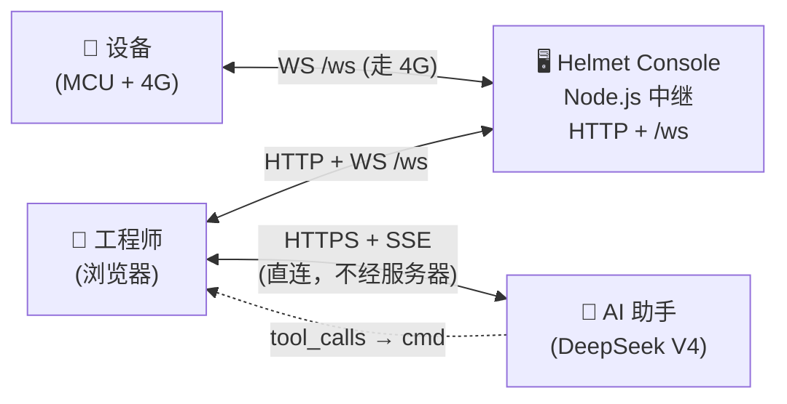
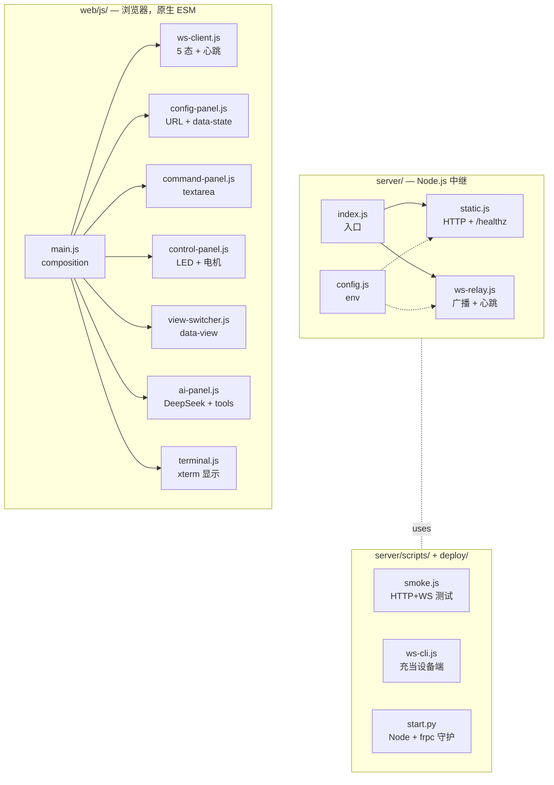

<div align="center">

# Helmet Console

---

### 面向嵌入式设备的主机端 WebSocket 中继

**服务器零解析，前端零构建。**


[English](README.md) | [简体中文](README.zh-CN.md)

---

</div>

一个 Node.js 进程同时承担两件事：把浏览器 UI 通过 HTTP 发出去，并在
浏览器与设备之间转发 WebSocket 帧。线上协议是 **平铺的 UTF-8 文本** ——
一帧一条命令，以 `\n` 结尾，没有 JSON 外壳。MCU 侧用 `strncmp` 派发，
浏览器侧用 xterm 原样展示字节。

> 为什么再造一个控制台？大多数串口 / WS 控制台要么绑了 SaaS，要么需要
> 构建管线，要么为了"结构化"把每一帧都套上 JSON。这一个尽量不挡路：
> 服务器零解析、前端零构建、你输入的每一帧就是设备看到的每一帧。

---

## 特性

- **只转发，不解析** —— 服务器从不读命令内容（唯一例外：`ping` →
  `pong\n`）。不持久化、不维护白名单、不强约束 schema。新增动词不需要
  改服务端。
- **原生浏览器 ESM** —— `web/` 直接通过 `<script type="module">` 加载。
  没有 Vite、没有 Webpack、没有框架运行时。
- **一屏三视图** —— 终端（xterm + 命令栏）、设备控制面板（LED + 电机
  开关/挡位）、AI 助手视图（浏览器直连 DeepSeek V4，把 `tool_calls`
  翻译成同一套平铺文本命令）。
- **弹性 WS 客户端** —— 5 态状态机、指数退避重连（1s · 2s · 4s · 8s ·
  16s）、30s 心跳、45s 失活检测。
- **对 MCU 友好的协议** —— `led_on\n`、`motor_speed_3\n`。用 `strcmp`
  派发即可；不需要 cJSON、不需要长度前缀、不需要掩码层。
- **本地优先部署** —— 默认跑在 `localhost`；可选一行 frp 隧道脚本对公
  网暴露（自带域名 / VPS / token）。

---

## 架构



只有浏览器知道命令含义。AI 也在浏览器里跑 —— API key 留在
`localStorage`，从不进服务器。服务器对字节是纯透传。

完整的模块图、命令字典、状态机和延后扩展见
[`docs/architecture.md`](docs/architecture.md)。

---

## 快速开始

```bash
git clone <this-repo>
cd helmet-console
npm install
npm start
# → http://127.0.0.1:8080
```

打开页面，点 **连接**（URL 输入框默认是 `ws://127.0.0.1:8080/ws`），
然后输入一条命令。如果手头没有真实设备，本地起第二个客户端扮演设备：

```bash
echo "temp=42.3" | node server/scripts/ws-cli.js
```

然后在浏览器里发 `led_on`，看它在 cli 这边收到。

---

## 发送命令

任何以 `\n` 结尾的 UTF-8 文本行都是一帧。浏览器命令栏会按 `\n` 拆分
多行输入，所以设备永远不必处理帧边界。

| 帧                                | 方向            | 含义               |
| --------------------------------- | --------------- | ------------------ |
| `led_on\n` · `led_off\n`          | 浏览器 → 设备   | LED 开关           |
| `led_color_<white\|red\|green>\n` | 浏览器 → 设备   | 设置 LED 颜色      |
| `motor_speed_<0..3>\n`            | 浏览器 → 设备   | 设置电机挡位       |
| `state:led=…,motor=…\n`           | 浏览器 → 对端   | 尽力广播的 UI 快照 |
| 任意 UTF-8 文本（`temp=42.3\n`…） | 设备 → 浏览器   | 自由格式遥测       |
| `ping\n` / `pong\n`               | 客户端 ↔ 服务器 | 心跳               |

新动词随便加 —— 服务器不维护任何注册表。浏览器与设备的"词汇表"是双方
私下约定的。完整契约见 [`docs/interface.md`](docs/interface.md)。

---

## 仓库结构

```
helmet-console/
├── server/        Node.js 中继（composition + sirv + ws）
├── web/           原生浏览器 ESM UI（无构建）
├── deploy/        一键启动器 + frp 隧道模板
├── docs/          架构、接口、部署、贡献指南
└── .trellis/      分包代码规范 + AI 工作流文件
```



> 模块之间从不直接 import —— `main.js` 通过注入回调把它们拼起来。
> 单一写入者：`config-panel.js` 拥有 `console.ws.*` 与
> `.app-shell[data-state]`；`view-switcher.js` 拥有
> `.app-shell[data-view]`；`ai-panel.js` 拥有 `console.ai.*`。

---

## 质量检查

```bash
npm test              # ESLint + smoke（HTTP / WS 广播 / ping / 二进制关闭）
npm run format:check  # Prettier
npm run lint          # 仅 ESLint
```

冒烟脚本（`server/scripts/smoke.js`）会拉一个临时服务器并断言：

- `/healthz` 返回 `{ status: "ok", clients: 0 }`。
- 两个 WS 客户端可逐字节互发广播。
- `ping\n` 被回以 `pong\n`（且不会被广播出去）。
- 二进制帧会以错误码 `1003` 关闭对应连接。

`commit-msg` git hook（基于 `simple-git-hooks` + `commitlint`）强制
[Conventional Commits](https://www.conventionalcommits.org/) 规范。

---

## 部署

**纯本地** —— `npm start`，就这样。

**公网入口（frp 隧道）** —— `python deploy/start.py` 同时拉起 Node 和
`frpc`。你需要自备 VPS、frps token 与域名；脚本会守护这两个进程并打印
连接 URL。前置条件见 [`deploy/deploy.md`](deploy/deploy.md)，环境变量
与反向代理配置见 [`docs/deployment.md`](docs/deployment.md)。

---

## 文档

| 文档                                           | 读者                                |
| ---------------------------------------------- | ----------------------------------- |
| [`docs/architecture.md`](docs/architecture.md) | 系统形态、模块、协议、状态机        |
| [`docs/interface.md`](docs/interface.md)       | HTTP 路由 + WebSocket 契约          |
| [`docs/deployment.md`](docs/deployment.md)     | 环境变量、反向代理、冒烟检查        |
| [`docs/contributing.md`](docs/contributing.md) | 分支流程、提交规范、格式化          |
| [`deploy/deploy.md`](deploy/deploy.md)         | 本地优先的 frp 隧道部署（自带配置） |
| [`CHANGELOG.md`](CHANGELOG.md)                 | 发布记录                            |

供 AI 协作者使用的编码规则在 [`.trellis/spec/`](.trellis/spec/)
（backend / frontend / 共享指南）。

---

## 许可证

[MIT](LICENSE)
