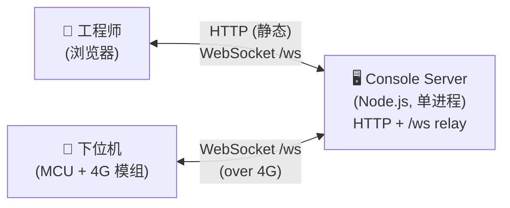
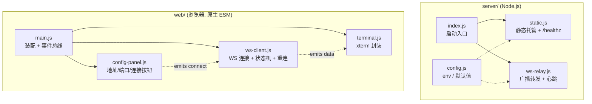
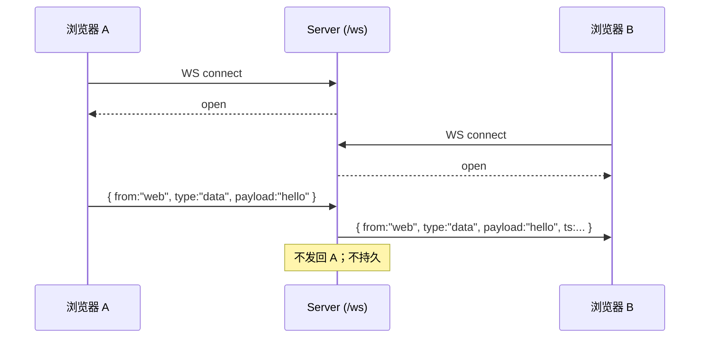
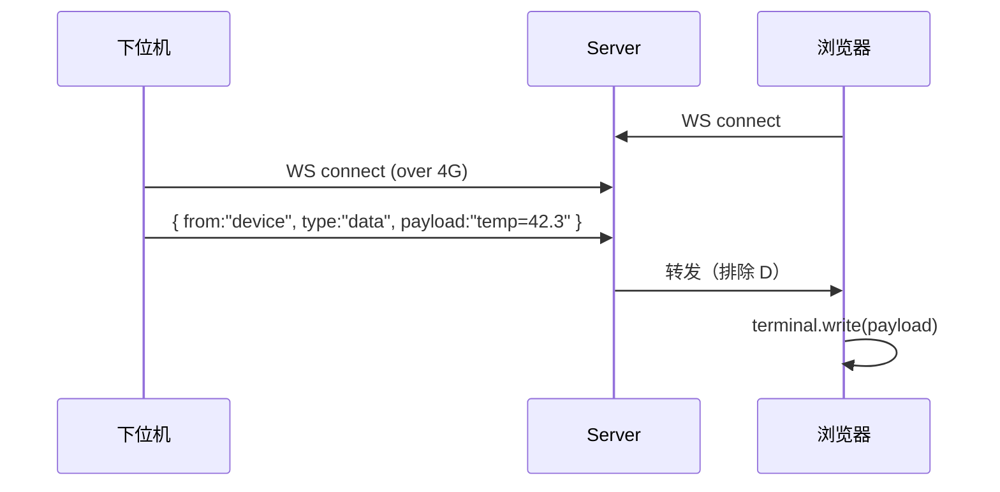
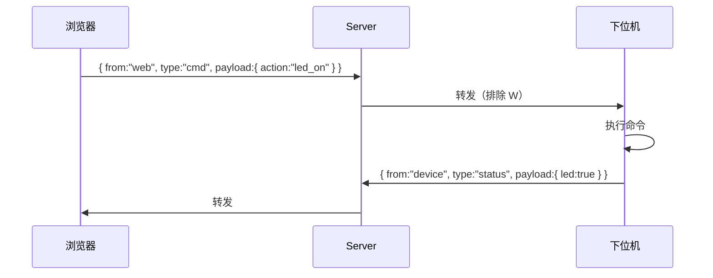
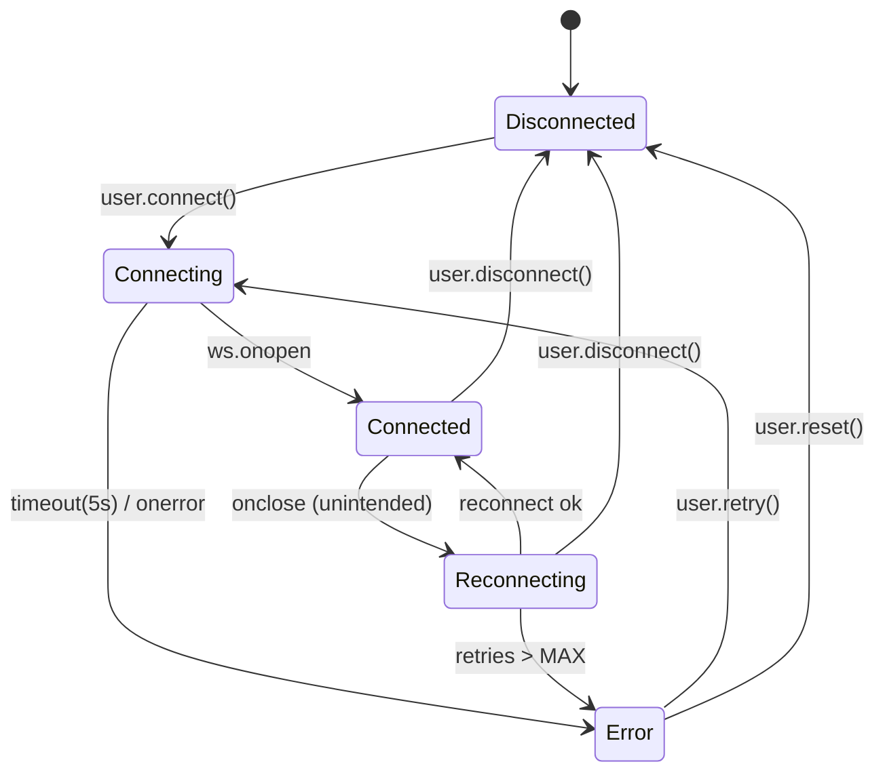

# Architecture — Smart Terminal Console (Host-Side)

> 一份**轻量** WS 转发上位机系统的设计文档。聚焦"够用就停"，不画大型 UML、不做容量规划。
> 受众：当前/未来开发者、AI 协作者。
> 配套：`prd.md`（需求与决策） · `interface.md`（待写，详细接口） · `deployment.md`（待写）

---

## 1. 系统上下文



**外部角色**：

| 角色           | 接入方式           | 职责                                              |
| -------------- | ------------------ | ------------------------------------------------- |
| 工程师         | 浏览器 → HTTP + WS | 查看终端输出、下发指令、配置服务地址              |
| 下位机         | 4G 模组 → WS       | 上报数据、接收命令、回报状态                      |
| Console Server | —                  | HTTP 托管前端静态资源 + WS 消息转发，**不持久化** |

**关键约束**（来自 PRD）：

- 服务器**只做转发**（broker 模式），不缓存、不存历史
- 部署形态为 Web (B/S)，前端可配置目标 WS 服务地址端口
- 下位机与浏览器在协议层**对等**，都是 WS 客户端
- 极轻量：后端无 Web 框架，前端无构建工具

---

## 2. 模块图



**模块职责矩阵**：

| 模块                  | 单一职责                                | 不做的事             |
| --------------------- | --------------------------------------- | -------------------- |
| `server/index.js`     | 进程入口、装配 http + relay             | 业务逻辑             |
| `server/static.js`    | 静态文件 + `/healthz` 端点              | WS 处理              |
| `server/ws-relay.js`  | 维护 client 列表、广播、心跳            | 消息内容理解（透传） |
| `server/config.js`    | 读取环境变量、给默认值、导出常量        | I/O                  |
| `web/main.js`         | DOM 装配、模块连线                      | WS / 终端细节        |
| `web/ws-client.js`    | 建连、状态机、重连、ping/pong、收发回调 | UI                   |
| `web/terminal.js`     | xterm 实例、写入数据、resize            | WS / 业务            |
| `web/config-panel.js` | 表单与按钮、读写 localStorage           | WS / 终端            |

> 跨模块通信遵循 **单向数据流**：UI → ws-client → server → ws-client → terminal。模块间不直接互调，通过 `main.js` 装配时传入回调。

---

## 3. 数据流时序

### 3.1 浏览器 ↔ 浏览器（多端协作场景）



### 3.2 下位机 → 浏览器（数据上报）



### 3.3 浏览器 → 下位机（命令下发）



> 三种场景**走同一个 `/ws` 端点、同一套消息格式、同一段广播代码**——这是协议统一带来的简化。

---

## 4. WebSocket 消息协议

### 4.1 帧结构

每帧是一个 **UTF-8 JSON 文本**（不用 binary frame，方便调试）：

```json
{
  "from": "web | device | server",
  "type": "data | cmd | status | error | ping | pong",
  "payload": <任意 JSON>,
  "ts": 1735603200000
}
```

| 字段      | 必需 | 说明                                                    |
| --------- | ---- | ------------------------------------------------------- |
| `from`    | ✓    | 客户端自标识；`server` 仅服务器自身使用（pong / error） |
| `type`    | ✓    | 消息语义分类，见下表                                    |
| `payload` | ✓    | 可为 string / object / null；服务器**不解释**内容       |
| `ts`      | ✗    | Unix 毫秒；客户端可省略，服务器在转发时补齐             |

### 4.2 type 枚举

| type     | 来源            | 用途                             | payload 示例                       |
| -------- | --------------- | -------------------------------- | ---------------------------------- |
| `data`   | web / device    | 通用数据流（终端文本、传感器值） | `"temp=42"` 或 `{ k:"hum", v:55 }` |
| `cmd`    | web             | 下行命令                         | `{ action:"led_on" }`              |
| `status` | device          | 状态回报                         | `{ led:true, motor_speed:3 }`      |
| `error`  | server / device | 错误通知                         | `{ code:"PARSE_FAIL", msg:"..." }` |
| `ping`   | client          | 心跳探测                         | `null`                             |
| `pong`   | server          | 心跳响应                         | `null`                             |

### 4.3 服务器行为合约

| 输入                         | 输出                                                                                |
| ---------------------------- | ----------------------------------------------------------------------------------- |
| 任意 client 发来合法 JSON 帧 | 广播给**除发送方外**所有 client，补充 `ts`                                          |
| `type:"ping"`                | 直接回 `{ from:"server", type:"pong", ts:... }` 给发送方                            |
| 非 JSON / 字段缺失           | 回 `{ from:"server", type:"error", payload:{ code:"BAD_FRAME" } }` 给发送方，丢弃帧 |
| client 断开                  | 从客户端列表移除，无副作用                                                          |

> 服务器**永远不读 `payload` 内容**——这是"轻量 + 不耦合业务"的核心。

---

## 5. 客户端状态机（前端 ws-client.js）



**状态对应 UI 徽章**：

| 状态         | 颜色 | 文本             |
| ------------ | ---- | ---------------- |
| Disconnected | 灰   | 未连接           |
| Connecting   | 黄   | 连接中…          |
| Connected    | 绿   | 已连接           |
| Reconnecting | 橙   | 重连中 (n/MAX)   |
| Error        | 红   | 错误（点击重试） |

---

## 6. 错误处理与重连策略

### 6.1 重连（前端）

- 触发条件：`Connected` → `onclose` 且 `code !== 1000`（非正常关闭）
- 退避序列：**1s · 2s · 4s · 8s · 16s**（指数退避，封顶 16s）
- 最大重试次数：**5**（可由 UI 改）
- 重试中用户主动断开 → 立即停止
- 每次重试都更新徽章计数

### 6.2 错误分类与处理

| 来源 | 错误                     | 处理                                                              |
| ---- | ------------------------ | ----------------------------------------------------------------- |
| 前端 | WS error 事件            | 进入 Error 状态，UI 红色，终端打印 `[ws] error: <reason>`         |
| 前端 | JSON.parse 失败          | 终端打印 `[ws] bad frame`，丢弃                                   |
| 后端 | 消息解析失败             | 回发 `{type:"error", payload:{code:"BAD_FRAME"}}`，丢弃           |
| 后端 | 单 client 抛异常         | `try/catch` 包裹，关闭该连接，移除列表，log；其他 client 不受影响 |
| 后端 | 进程级 uncaughtException | 仅 log，不退出（可选：5 次内退出由 systemd/PM2 拉起）             |

### 6.3 心跳

- 前端每 **30s** 发 `{type:"ping"}`
- 服务器立即回 `pong`
- 前端若 **45s** 未收到任何帧（含 pong / 数据） → 主动 `ws.close()` → 触发重连

---

## 7. 配置项

服务器读环境变量，前端读 `localStorage` + UI 表单。

### 7.1 服务器（环境变量）

| 名             | 默认      | 说明                          |
| -------------- | --------- | ----------------------------- |
| `PORT`         | `8080`    | HTTP + WS 监听端口            |
| `HOST`         | `0.0.0.0` | 监听地址                      |
| `WS_PATH`      | `/ws`     | WS 端点路径                   |
| `STATIC_DIR`   | `../web`  | 静态文件根（相对 `server/`）  |
| `MAX_CLIENTS`  | `32`      | 同时连接上限，超出拒绝并 log  |
| `HEARTBEAT_MS` | `30000`   | （保留；当前心跳由前端发起）  |
| `LOG_LEVEL`    | `info`    | `error / warn / info / debug` |

### 7.2 前端（localStorage 键）

| 键                | 类型    | 说明                                   |
| ----------------- | ------- | -------------------------------------- |
| `console.ws.host` | string  | 用户填写的服务器地址（如 `127.0.0.1`） |
| `console.ws.port` | string  | 端口（默认与 server 端 PORT 一致）     |
| `console.ws.path` | string  | WS 路径（默认 `/ws`）                  |
| `console.ws.tls`  | boolean | 是否使用 wss（默认 false）             |

> 前端**首次访问**用上述默认值；用户改动后写入 localStorage，下次直接读取。

---

## 8. 部署形态（约束）

- **必须 HTTP 访问**，禁止 `file://` 直开（用户明确要求）
- 单进程：`node server/src/index.js` 即可启动 HTTP + WS
- 部署目标：Linux / Windows / macOS 任一可跑 Node 18+ 的环境
- 反向代理（可选）：nginx 转发 80 → :8080，并升级 WS 头（详见后续 `deployment.md`）
- 不强制 Docker；后期可添加 `Dockerfile`（< 30 行）

---

## 9. 未来扩展点（不实现，仅占位避免设计上堵死）

| 扩展                        | 触发条件         | 影响面                                        |
| --------------------------- | ---------------- | --------------------------------------------- |
| TLS / wss                   | 公网部署         | 反代或 Node `https.createServer`              |
| 鉴权（token / basic）       | 多用户           | WS upgrade 阶段拦截 + 前端登录页              |
| TCP ↔ WS 桥                 | 4G 模组不支持 WS | server 增 net 监听 + 帧封装层                 |
| 消息持久化 + 回放           | 调试需要历史     | server 增 ringbuffer / sqlite，前端增"回放"UI |
| 多频道（topic）             | 设备分组         | 帧加 `topic` 字段，relay 按 topic 过滤        |
| 控件区（LED / 电机 / 图表） | v0.2             | web 新模块，复用 ws-client 即可               |

> 当前协议字段 `from / type / payload / ts` 已为上述大部分扩展预留空间；新增 `topic` 字段时旧客户端忽略它即可（向后兼容）。

---

## 10. 设计原则回顾

- **接口清晰分明**（用户原话）：HTTP 与 WS 各司其职，WS 帧只 4 个字段
- **轻量 / 不过度设计**（用户原话）：无框架、无构建、无数据库、无队列
- **服务器对业务零耦合**：只看 `from / type` 路由，不读 `payload`
- **前后端协议对称**：浏览器和下位机用同一套帧规范
- **失败可见**：所有错误都映射到 UI 状态徽章和终端 `[error]` 行
- **可扩展但不预扩展**：扩展点列出来，不预先实现
