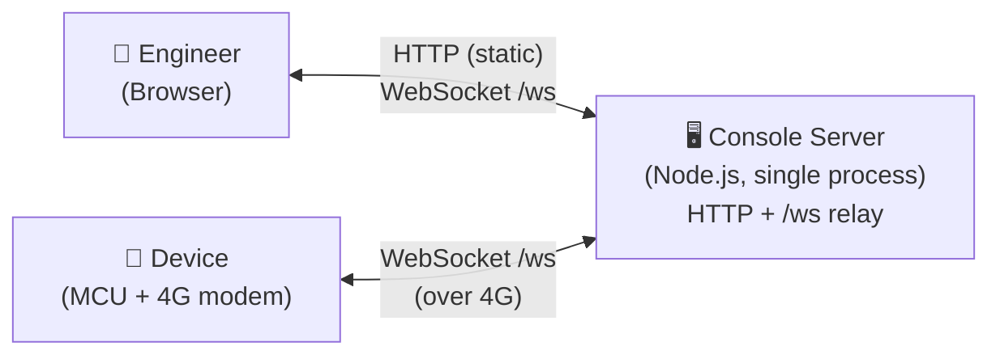
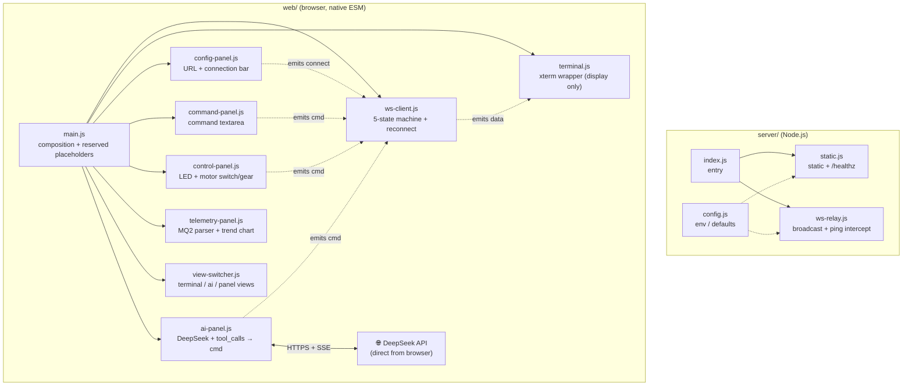
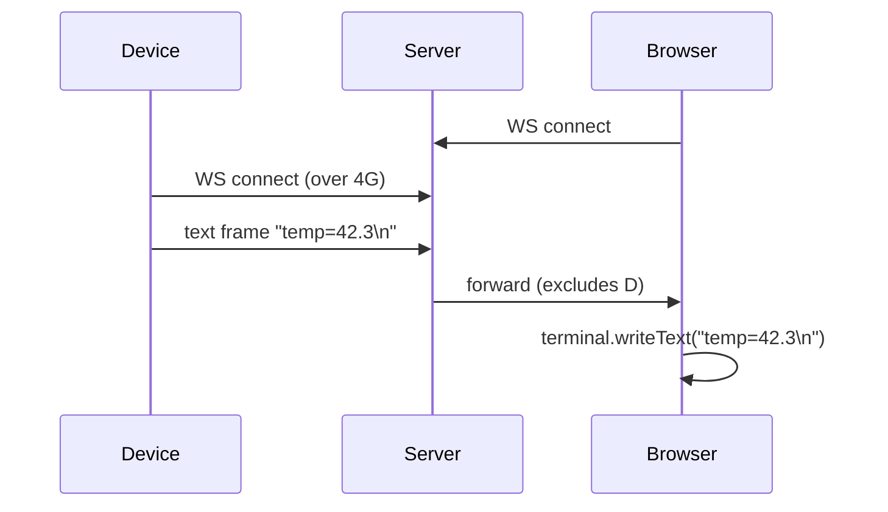
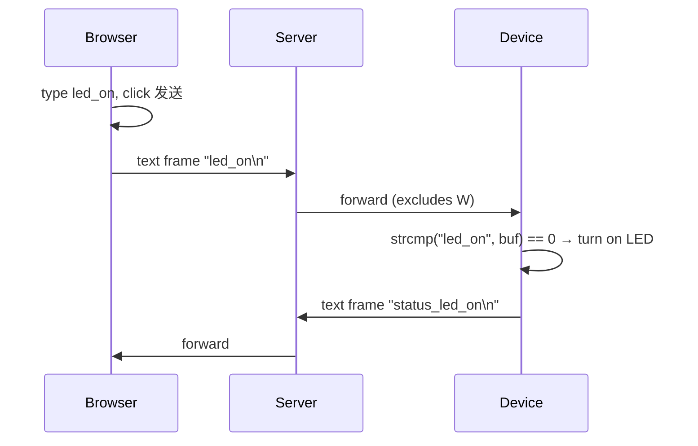
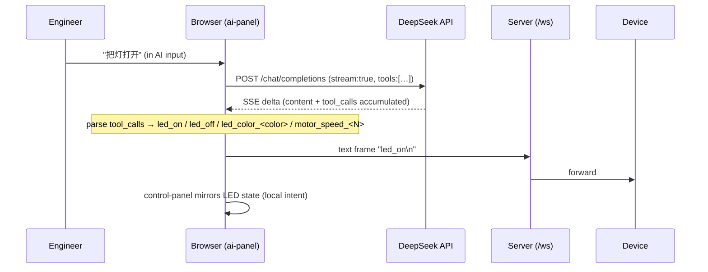
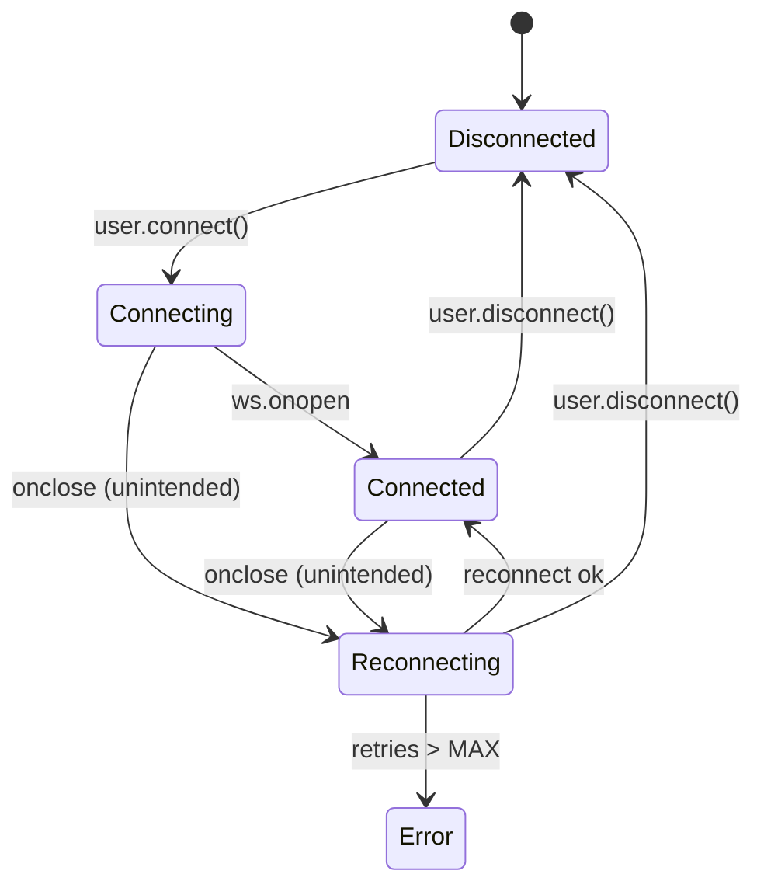

# Architecture — Helmet Console

> A lightweight host-side WebSocket relay for embedded devices.
> Audience: current/future developers and AI collaborators.
> Companions: [`interface.md`](./interface.md) (HTTP/WS contract),
> [`deployment.md`](./deployment.md) (deployment notes),
> [`contributing.md`](./contributing.md) (workflow).

---

## 1. System Context



| Role           | Path              | Responsibility                                    |
| -------------- | ----------------- | ------------------------------------------------- |
| Engineer       | Browser → HTTP+WS | View terminal, send commands, configure WS target |
| Device         | 4G modem → WS     | Stream telemetry, accept commands, report state   |
| Console Server | —                 | Static hosting + WS relay; **no persistence**     |

**Key constraints**:

- Server is a **broker**: forward-only, no cache, no history.
- Web (B/S) deployment; the front-end UI lets the user point at any WS host.
- Browser and device are **peers** at the protocol layer (both are WS clients).
- Lightweight: no web framework on the server, no build tool on the front-end.

---

## 2. Module Diagram



For per-module ownership see
`.trellis/spec/backend/quality-guidelines.md` and
`.trellis/spec/frontend/quality-guidelines.md`.

> **Single-direction data flow**: `command-panel` / `control-panel` /
> `ai-panel` → `ws-client` → server → `ws-client` → `terminal`.
> Modules never talk directly; `main.js` wires them via callbacks.

---

## 3. Data Flow

### 3.1 Browser ↔ Browser (multi-client)

```mermaid
sequenceDiagram
    participant A as Browser A
    participant S as Server (/ws)
    participant B as Browser B
    A->>S: WS connect
    B->>S: WS connect
    A->>S: text frame "AT+PING\n"
    S->>B: text frame "AT+PING\n"
    Note over S: not echoed to A; not persisted; byte passthrough
```

### 3.2 Device → Browser (telemetry)



### 3.3 Browser → Device (command)



> All three flows share the same `/ws` endpoint, the same wire format,
> and the same broadcast code path.

### 3.4 Browser AI view → DeepSeek → Device



> **Design choice**: DeepSeek calls go **direct from browser** to
> `api.deepseek.com`, not via the Node relay. The relay stays purely a
> WS broker; the API key lives in browser `localStorage`
> (`console.ai.apiKey`) as a personal credential, never on the server.
>
> `ai-panel` does not hold the WS connection itself — `tool_calls` go
> through the `onTool(command)` callback wired in `main.js` to
> `ws-client`. LED / motor UI is mirrored locally before send (not
> awaiting device echo).

---

## 4. WebSocket Protocol

### 4.1 Frame Structure

Each frame is a single UTF-8 **text** message — one command per frame,
terminated by `\n`. **No** binary frames, JSON envelopes, length
prefixes, or field schemas. **The wire is the command.**

```text
led_on\n
led_off\n
led_color_red\n
motor_speed_3\n
state:led=red,motor=3\n
ping\n
pong\n
```

Why: MCUs can dispatch with `strncmp` — no JSON parser needed (saves
flash + RAM). Debugging is trivial — `websocat` or DevTools Network
panel shows the command directly.

### 4.2 Command Dictionary v1

| Frame                                               | Direction        | Meaning                                                    |
| --------------------------------------------------- | ---------------- | ---------------------------------------------------------- |
| `led_on\n`                                          | browser → device | Turn on LED (defaults to white)                            |
| `led_off\n`                                         | browser → device | Turn off LED                                               |
| `led_color_<white\|red\|green>\n`                   | browser → device | Set LED color and turn on                                  |
| `motor_speed_<0..3>\n`                              | browser → device | Set motor gear (0=stop, 3=max)                             |
| `state:led=<off\|white\|red\|green>,motor=<0..3>\n` | browser → peers  | Best-effort UI snapshot after a control; device may ignore |
| `ping\n` / `pong\n`                                 | client ↔ server  | Heartbeat (see §6.3)                                       |
| any UTF-8 text                                      | device → browser | Free-form (e.g. `temp=42.3\n`); server passes through      |

New verbs: just add them. Server holds no command table; browser and
device negotiate vocabulary directly.

### 4.3 Server Behavior

| Input                         | Output                                                                 |
| ----------------------------- | ---------------------------------------------------------------------- |
| Text frame `ping` or `ping\n` | Reply `pong\n` to sender; **do not** broadcast                         |
| Any other text frame          | Byte-for-byte broadcast to every other client; no `\n` append, no `ts` |
| Binary frame                  | Close socket with code `1003 unsupported data`; no broadcast           |
| Client disconnect             | Drop from client list; no side effect                                  |

> The server **never** reads command content. Adding a content-based
> branch breaks the "business-agnostic relay" invariant.

---

## 5. Client State Machine (`ws-client.js`)



`ws-client.js` keeps the 5 internal states; `config-panel.js` collapses
them onto **3 visual states** (`disconnected` / `connected` / `error`).
The mapping table is in `.trellis/spec/frontend/quality-guidelines.md`
§"3-State UI Surface".

---

## 6. Resilience

### 6.1 Reconnect (frontend)

- Trigger: `Connected` → `onclose` with `code !== 1000`.
- Backoff: **1s · 2s · 4s · 8s · 16s** (capped).
- Max retries: **5**.
- User-initiated disconnect during retry → stop immediately.

### 6.2 Errors

| Source   | Trigger                  | Action                                             |
| -------- | ------------------------ | -------------------------------------------------- |
| Frontend | WS error event           | Print `[ws] error`; reconnect if connection closed |
| Frontend | Binary frame in          | `[ws] dropped binary frame`; discard               |
| Backend  | Binary frame from client | `ws.close(1003)`; other clients unaffected         |
| Backend  | WS client error          | `console.warn`; other clients unaffected           |

### 6.3 Heartbeat

- Frontend sends `ping\n` every **30 s**.
- Server replies `pong\n` immediately (never broadcast).
- Frontend closes the socket after **45 s** of inactivity (any frame
  counts: `pong` or device data) → triggers reconnect.
- `pong\n` is consumed by `ws-client`; the terminal never shows it.

---

## 7. Configuration

Server: env vars (see [`./deployment.md`](./deployment.md)).

Frontend: `localStorage` (`console.ws.*` for connection target,
`console.ai.*` for DeepSeek). Tables and write-rules are in
`.trellis/spec/frontend/state-management.md`.

---

## 8. Deployment

- **HTTP only** (no `file://`); single process: `node server/src/index.js`.
- Targets: any Node 18+ host (Linux / Windows / macOS).
- Optional reverse proxy: nginx → `:8080`, with WebSocket upgrade headers.
- Optional dev tunnel: `python deploy/start.py` runs Node + `frpc` for
  public ingress (BYO domain/VPS/token; see
  [`./deployment.md`](./deployment.md) and `deploy/deploy.md`).

---

## 9. Deferred Extensions

Place-holders so the design isn't blocked, **not** implemented:

| Extension                               | Trigger                 | Surface                                                 |
| --------------------------------------- | ----------------------- | ------------------------------------------------------- |
| TLS / wss                               | Public deployment       | Reverse proxy or `https.createServer`                   |
| Auth (token / basic)                    | Multi-user              | Intercept WS upgrade + login page                       |
| TCP ↔ WS bridge                         | Modem without WS        | Server-side `net` listener + frame layer                |
| Persistence + replay                    | Need history            | ringbuffer / SQLite + replay UI                         |
| Topic channels                          | Device groups           | Verb prefix (`helmet1:led_on`); relay still passthrough |
| Doc panel / sidebar / copy / fullscreen | Topbar / terminal icons | Reserved DOM slots already exist                        |

> Wire stays flat strings — extending only changes browser + device.
> Old clients ignore unknown verbs (forward compatible).

---

## 10. Design Principles (recap)

- **Clear separation**: HTTP and WS each do one job; the WS frame _is_ the command.
- **Lightweight**: no framework, no build tool, no database, no queue, **no JSON envelope**.
- **Server is business-agnostic**: not a single byte parsed (except `ping`).
- **Symmetric protocol**: browser and device speak the same flat strings.
- **MCU-friendly**: dispatch with `strcmp` / `strncmp`, no cJSON.
- **Failure visible**: every error maps to the UI status pill or terminal log.
- **Extensible without speculation**: extension points documented; not pre-built.
